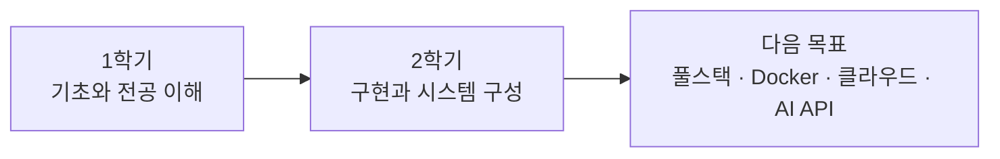

# 오민석 | Minseok Oh

### 기록하고, 만들고, 성장하는 빅데이터소프트웨어과 1학년

**Backend · Big Data · Cloud · Service Planning**

---

## 👤 Profile

| 항목 | 내용 |
|---|---|
| 이름 | 오민석 (Minseok Oh) |
| 소속 | 한국폴리텍대학 서울강서캠퍼스 빅데이터소프트웨어과 1학년 |
| 관심 분야 | 백엔드 · 빅데이터 · 클라우드 · 서비스 기획 |
| 목표 | 사회 문제를 데이터와 소프트웨어로 해결하는 개발자 |
| Email | [oms50112@gmail.com] |

> 배운 것을 기록하고, 직접 구현하면서 다음 단계로 나아가고 있습니다.

---

## 🏆 Competition

### 「민관협력 지원 플랫폼 활용」 기반 사회 현안 해결 서비스 개발 공모전

| 항목 | 내용 |
|---|---|
| 프로젝트 | 사회 현안 해결을 위한 서비스 개발 프로젝트 |
| 기간 | 2026.07 ~ 2026.11 |
| 상태 | 기획서 제출 완료 · 개발 및 테스트 진행 중 |
| 팀 | 3명 (팀 프로젝트) |
| 내 역할 | [날씨설계,그외 설계보조] |
| 상세 내용 | 공모전 진행 중으로 현재 비공개 |

---

## 🗺️ Learning Map

### 1학기 — 전공 기초와 개발 환경 이해

| 과목 | 배운 내용 |
|---|---|
| 프로그램 언어 | 문법과 프로그래밍 기초 |
| 자료구조 | 자료구조 개념과 활용 |
| 운영체제 | 운영체제 개념과 시스템 동작 원리 |
| 데이터베이스 실무 | 데이터베이스 활용과 데이터 관리 실습 |
| 빅데이터 시각화 | 데이터 시각화와 분석 |
| 스프링부트 프레임워크 실습 | Spring Boot 기반 백엔드 개발 입문 |
| 생성형 AI와 직업·경력 | 생성형 AI 활용과 진로 탐색 |

### 2학기 — 서비스 구현과 데이터·클라우드 학습 (진행 중)

| 과목 | 배우는 내용 |
|---|---|
| 스프링부트 | Spring Boot 이해, MyBatis로 공지사항 게시판 구현 |
| 데이터 모델링 | 데이터 구조화와 모델 설계 |
| NoSQL | NoSQL 데이터베이스의 개념과 활용 |
| 빅데이터 플랫폼 | Rocky Linux · MariaDB · Hadoop 설치와 환경 구성 |
| 빅데이터 프로그래밍 | 대용량 로그·텍스트 데이터 처리 |
| 클라우드 | AWS EC2 · RDS, 도메인 및 HTTPS 연동 |
| Vue.js | 프론트엔드 개발 입문 |
| 소프트웨어공학 | 소프트웨어 개발 과정과 방법론 |
| 정보통신 | 정보통신 기초 |

### 🎯 Next Goals

| 목표 | 계획 |
|---|---|
| Full Stack | Spring Boot와 Vue.js를 연결한 풀스택 서비스 완성 |
| Docker | Docker를 활용한 서비스 구성과 배포 경험 |
| Cloud | 클라우드 환경에 직접 서비스를 배포 |
| AI Service | AI API를 연동한 서비스 구현 |

---

## 🎓 Education

**한국폴리텍대학 서울강서캠퍼스** · 빅데이터소프트웨어과 · 1학년 (2026.03 ~)

전공 수업을 통해 프로그램 언어, 자료구조, 데이터베이스, 빅데이터, Spring Boot, 클라우드의 기초를 학습하고 있습니다.

---

## 🚀 앞으로의 방향

저는 처음부터 잘하는 사람이 아니라, **실수하고 실패하면서 배우는 사람**입니다.

오류가 나면 그냥 넘어가지 않고, 원인을 찾아 고친 과정을 기록으로 남깁니다.

`시도` → `실패` → `원인 분석` → `수정` → `기록`

이 과정을 반복하면서 같은 실수를 조금씩 줄여가고 있습니다.

문제를 발견하고, 데이터를 이해하고, 소프트웨어로 해결할 수 있는 개발자로 성장하는 것이 목표입니다.

**실패를 기록으로 바꿔, 실제 문제를 해결하는 개발자로.**

Minseok Oh · Big Data Software · 2026

